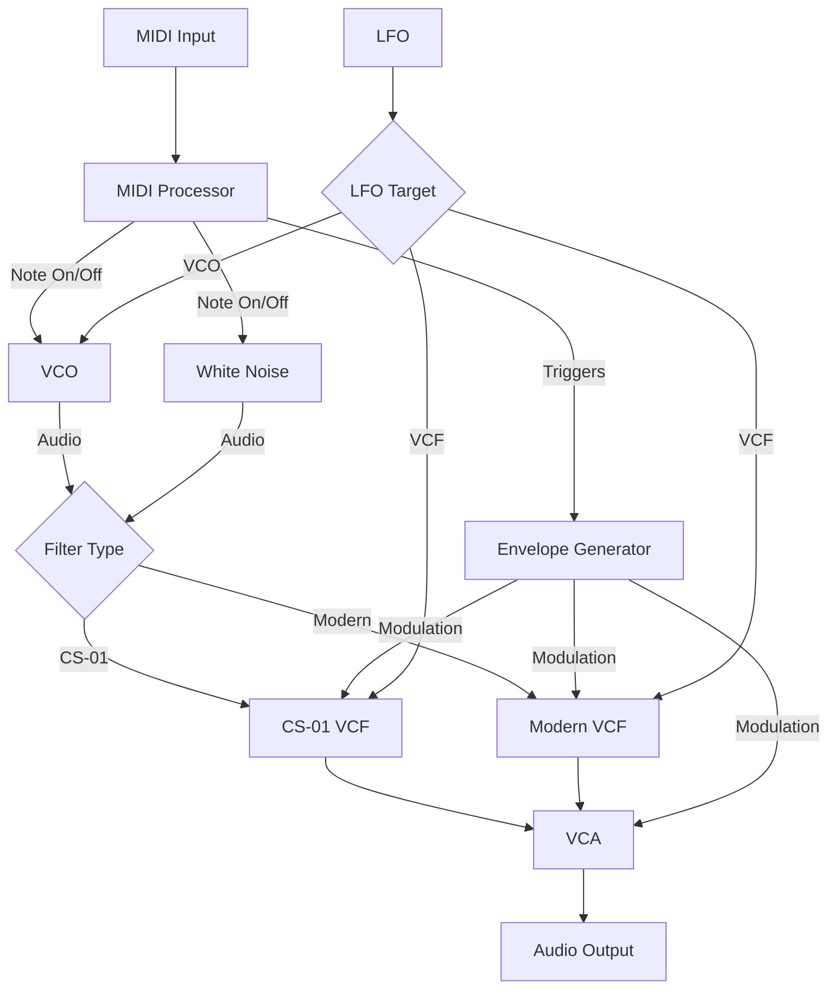

# CheapSynth01

[](https://github.com/yasuyuki-baba/cheapsynth01/actions/workflows/build.yml)
[](https://github.com/yasuyuki-baba/cheapsynth01/actions/workflows/tests.yml)
[](https://opensource.org/licenses/MIT)
[](https://isocpp.org/)
[](https://juce.com/)

CheapSynth01 is a software emulation of an early 80's compact monophonic synthesizer. Developed using the JUCE framework, it recreates classic analog sounds with precision.

## Features

- Faithful circuit emulation

## Signal Flow Architecture

CheapSynth01 uses JUCE's AudioProcessorGraph to implement a modular synthesis architecture. The signal flow changes dynamically based on parameter settings.



### Key Signal Paths:

1. **Main Audio Path**:
   - Sound Generation: VCO (oscillator) or Noise generator
   - Filtering: Either CS-01 VCF (vintage) or Modern VCF
   - Amplification: VCA controls final output level

2. **Control Paths**:
   - MIDI Processor: Handles note on/off, controls VCO/Noise and triggers EG
   - Envelope Generator: Modulates both VCA (amplitude) and VCF (filter cutoff)
   - LFO: Can be routed to either VCO (pitch modulation) or VCF (filter modulation)
   
3. **Dynamic Routing**:
   - Filter Type parameter switches between vintage and modern filter
   - Feet parameter switches between VCO and Noise as sound source
   - LFO Target parameter determines modulation destination

The architecture supports real-time parameter changes, allowing for expressive performances and sound design.

## Supported Platforms

- Windows
- macOS
- Linux

## Supported Plugin Formats

- Standalone application
- VST3
- AU (macOS only)
- LV2 (macOS and Linux only)

## Build Instructions

### Requirements

- CMake 3.15 or higher
- C++20 compatible compiler
- JUCE (automatically fetched by CMake)

### Build Steps

```bash
# Create and configure build directory
cmake -B build

# Build the project
cmake --build build
```

### Running Tests

To run the tests locally:

```bash
./run_tests.sh
```

This will build and run all tests, generating a detailed test report in XML format.

## Usage

Load the plugin in your DAW or launch the standalone application.

## Development

### Continuous Integration

This project uses GitHub Actions for continuous integration. On each push and pull request to any branch, the following actions are performed:

- Building the project on multiple platforms (Windows, macOS, Linux)
- Running all tests
- Generating and publishing test reports

You can view the latest test results in the Actions tab of the GitHub repository.

## License

This project is released under the MIT License. See the LICENSE file for details.
