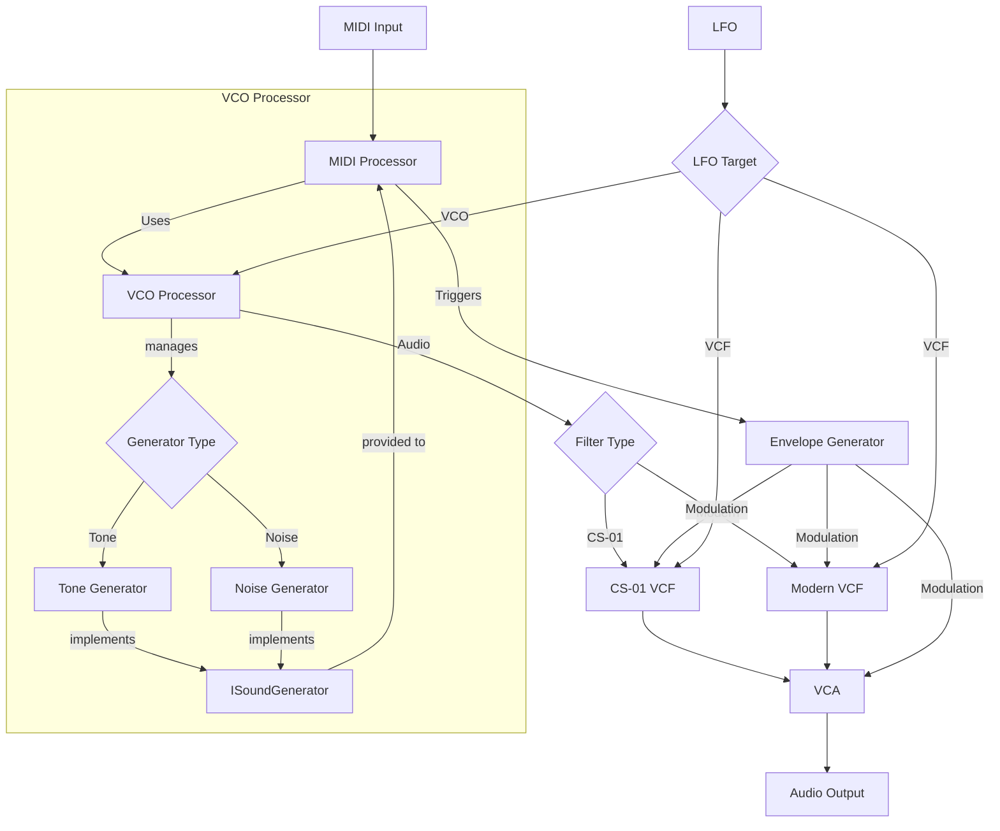

# CheapSynth01

CheapSynth01 is a software emulation of an early 80's compact monophonic synthesizer. Developed using the JUCE framework, it recreates classic analog sounds with precision.

## Features

- Faithful circuit emulation

## Signal Flow Architecture

CheapSynth01 uses JUCE's AudioProcessorGraph to implement a modular synthesis architecture. The signal flow changes dynamically based on parameter settings.

### Key Signal Paths:

1. **Main Audio Path**:
   - Sound Generation: VCO Processor managing Tone Generator and Noise Generator
   - Filtering: Either CS-01 VCF (vintage) or Modern VCF
   - Amplification: VCA controls final output level

2. **Control Paths**:
   - MIDI Processor: Interacts with VCO Processor via ISoundGenerator interface
   - Envelope Generator: Modulates both VCA (amplitude) and VCF (filter cutoff)
   - LFO: Can be routed to either VCO (pitch modulation) or VCF (filter modulation)
   
3. **Dynamic Routing**:
   - Filter Type parameter switches between vintage and modern filter
   - Feet parameter switches between Tone and Noise generators within the VCO Processor
   - LFO Target parameter determines modulation destination

4. **Architecture Pattern**:
   - Centralized communication via CS01AudioProcessor
   - Interface-based design with ISoundGenerator
   - Component decoupling using callback functions

The architecture supports real-time parameter changes, allowing for expressive performances and sound design.

## Supported Platforms

- Windows
- macOS
- Linux

## Supported Plugin Formats

- Standalone application
- VST3
- AU (macOS only)
- LV2 (macOS and Linux only)

## Build Instructions

For build instructions and development setup, please see [CONTRIBUTING.md](CONTRIBUTING.md).

## Usage

Load the plugin in your DAW or launch the standalone application.

## License

This project is released under the MIT License. See the LICENSE file for details.
