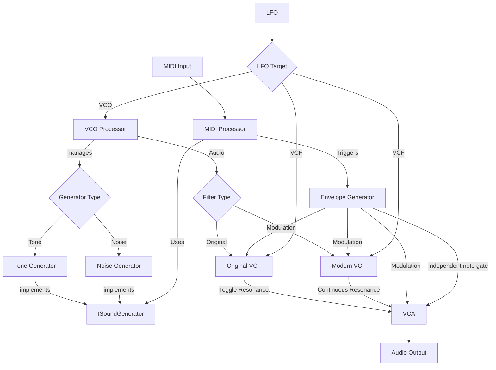

# CheapSynth01

[![DeepWiki](https://img.shields.io/badge/DeepWiki-yasuyuki--baba%2Fcheapsynth01-blue.svg?logo=)](https://deepwiki.com/yasuyuki-baba/cheapsynth01)
<!-- DeepWiki badge generated by https://deepwiki.ryoppippi.com/ -->

CheapSynth01 is a JUCE-based software emulation of an early 80's compact monophonic synthesizer. It combines circuit-informed modeling with provisional DSP approximations where hardware characteristics remain unresolved.

## Features

- Circuit-informed synthesis with documented modeling limitations
- Six factory sounds transcribed from the CS01 owner's manual
  ([panel readings and usage](docs/Factory-presets.md))
- Two filter types with different resonance control modes:
  - Original VCF with toggle resonance (High/Low)
  - Modern VCF with continuous resonance control

## Signal Flow Architecture

CheapSynth01 uses JUCE's AudioProcessorGraph with fixed filter and LFO connections.
At the start of each host audio callback, parameter settings select the enabled
filter path and modulation destination. The diagram shows the effective paths;
the switches represent processor selection rather than graph rewiring.
The complete synthesis graph runs at 4x the host sample rate, with IIR
downsampling at the output.

```mermaid
graph TD
    MIDI[MIDI Input] --> MidiProc[MIDI Processor]
    MidiProc --> |Triggers| EG[Envelope Generator]
    
    VCOProc[VCO Processor] --> |manages| GenSwitch{Generator Type}
    GenSwitch --> |Tone| ToneGen[Tone Generator]
    GenSwitch --> |Noise| NoiseGen[Noise Generator]
    ToneGen --> |implements| ISG[ISoundGenerator]
    NoiseGen --> |implements| ISG
    MidiProc --> |Uses| ISG
    
    VCOProc --> |Audio| FilterSwitch{Filter Type}
    
    FilterSwitch --> |Original| OriginalVCF[Original VCF]
    FilterSwitch --> |Modern| ModernVCF[Modern VCF]
    
    OriginalVCF --> |Toggle Resonance| VCA[VCA]
    ModernVCF --> |Continuous Resonance| VCA
    
    EG --> |Modulation| VCA
    EG --> |Modulation| OriginalVCF
    EG --> |Modulation| ModernVCF
    EG --> |Independent note gate| VCA
    
    LFO[LFO] --> LFOTarget{LFO Target}
    LFOTarget --> |VCO| VCOProc
    LFOTarget --> |VCF| OriginalVCF
    LFOTarget --> |VCF| ModernVCF
    
    VCA --> Output[Audio Output]
```

### Key Signal Paths:

1. **Main Audio Path**:
   - Sound Generation: VCO Processor managing free-running Tone and Noise generators; the selected source continues while the VCA is silent
   - Filtering: Either Original VCF (vintage) or Modern VCF
   - Amplification: VCA controls final output level

2. **Control Paths**:
   - MIDI Processor: Interacts with VCO Processor via ISoundGenerator interface
   - Envelope Generator: Modulates both VCA (amplitude) and VCF (filter cutoff)
   - Independent note gate: EGProcessor also gates the VCA's non-EG gain, keeping idle output silent when VCA EG depth is below one
   - LFO: Can be routed to either VCO (pitch modulation) or VCF (filter modulation)
   
3. **Route Selection**:
   - Filter Type parameter selects Original (vintage) or Modern input/output processing within the fixed graph
   - Each filter type has its own resonance control: Toggle mode for Original VCF and Continuous mode for Modern VCF
   - Feet parameter switches between Tone and Noise generators within the VCO Processor
   - LFO Target parameter determines modulation destination
   - Filter and LFO selection is applied on the audio side once per host callback

4. **Architecture Pattern**:
   - Centralized communication via CS01AudioProcessor
   - Interface-based design with ISoundGenerator
   - Component decoupling using callback functions

The architecture supports real-time parameter changes, allowing for expressive performances and sound design.

For stage ownership and numerical recovery, see [DSP responsibility boundaries](docs/DSP-responsibility-boundaries.md).
Envelope retriggers preserve residual state; active-stage time edits change
speed without restarting a full stage. See the [EG policy](docs/EG-stateful-model.md)
and [note onset continuity](docs/Note-onset-continuity.md) for the note gate,
transition behavior and validation limits.

## Supported Platforms

- Windows
- macOS
- Linux

## Supported Plugin Formats

- Standalone application
- VST3
- AU (macOS only)
- LV2 (macOS and Linux only)
- CLAP (CLever Audio Plugin)

## Build Instructions

For build instructions and development setup, please see [CONTRIBUTING.md](CONTRIBUTING.md).

## Usage

For a categorized index of usage, development, design and investigation material,
see the [documentation guide](docs/README.md).

See also the [MIDI implementation](docs/MIDI-Implementation.md),
[test guide](Tests/README.md), [circuit-model limitations](docs/Circuit-model-unknowns.md),
and [requested circuit resources](docs/Requested-circuit-resources.md).
Regression tests verify software behavior, not calibration against original hardware.

Load the plugin in your DAW or launch the standalone application.

## License

The project source LICENSE is GPLv3. JUCE 9.0.3 is licensed under AGPLv3 or an
applicable commercial JUCE licence; the distributor must resolve that route and
provide the corresponding source/notices. See [distribution and licence notes](docs/Distribution.md).

DSP architecture and modeling terminology: [responsibility boundaries](docs/DSP-responsibility-boundaries.md).
