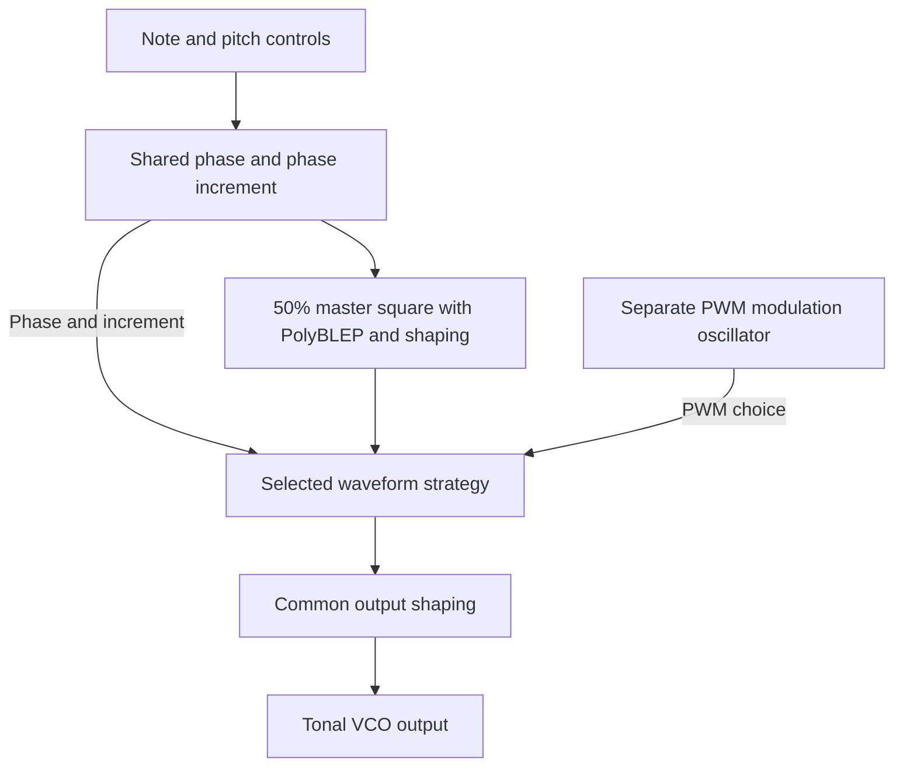

# Waveform generation from a shared source

The tonal generator uses one shared pitch/phase cycle to produce the selected
waveform. The waveform choices are different transformations of that common
source; they are not five independently tuned oscillators running in parallel.
This document describes the current software. The corresponding hardware
interpretation is recorded in [the YM10150 summary](../hardware/ymf10150.md).

## Shared pitch, phase and square wave

`ToneGenerator` combines the note/glissando position, pitch bend, fine pitch,
pitch LFO and feet octave offset. For that resulting semitone pitch `p`,
`YM10150::generateMasterSquareWave` calculates

```text
frequency = 440 * 2^((p - 69) / 12)
phaseIncrement = frequency / processingSampleRate
```

The shared phase runs through one cycle from 0 to 1. A 50%-duty square is
positive in the first half and negative in the second half. PolyBLEP corrects
its discontinuities to reduce digital aliasing; `tanh(1.2 * square)` then shapes
its amplitude. These are software waveform corrections, not a reconstructed
YM10150 digital clock/divider circuit.

For each generated sample, the master square is evaluated at the current phase,
then the phase advances. The selected waveform strategy receives that square,
the advanced phase and the shared phase increment. This ordering is part of
the implementation; a phase-derived branch is not evaluated at the same phase
instant as the already generated master square.



## How each waveform is obtained

| Choice | Inputs and transformation | Stateful behavior |
| --- | --- | --- |
| Triangle | Integrates the master square, producing alternating rising/falling slopes. Applies leaky integration, DC removal, amplitude scaling and a sine-based coloration term. | Retains an integrator and DC-removal state. |
| Sawtooth | Uses a descending ramp `1 - 2*phase`, adds a small leaky state driven by the master-square sign, then blends ramp and sine-shaped output. It is not obtained solely by integrating the square. | Retains the leaky correction state. |
| Square | Returns the shaped 50% master square to the common output stage. | No additional waveform-strategy state. |
| Pulse | Compares the shared phase with a fixed width of 0.25, then applies PolyBLEP edge correction and `tanh` shaping. | No additional waveform-strategy state. |
| PWM | Compares the shared phase with a varying width `0.5 + 0.4*PWM_LFO`, bounded to 0.05–0.95. Applies PolyBLEP, `tanh` and a small smoothed-output blend. | Retains the smoothing state; pulse width is driven by its separate modulation oscillator. |

All selected strategy outputs pass through `YM10150::shapeOutput`, which applies
`tanh(1.2 * value)`. Square therefore also passes through this final shaping;
it is not an unaltered copy of an ideal square. The gains, leakage, coloration
and smoothing are empirical software choices. The shared timing relates the
waveforms' pitch; it does not make their amplitude, spectrum or phase identical.
The code evaluates the selected strategy rather than mixing all five outputs.

PWM Speed controls the separate pulse-width oscillator; LFO Speed and LFO Target
control pitch/cutoff modulation. Changing width changes the pulse shape within
the common pitch cycle, not the nominal note frequency. Selecting Feet = WN
uses the separate `NoiseGenerator` instead of this tonal generation chain.

Production generates at 4x the host rate and downsamples at the output, as
specified in [oversampling and timing](Oversampling-validation.md). Neither
oversampling nor PolyBLEP establishes alias-free output or hardware equivalence.
After waveform generation, VCF/VCA/EG control the resulting tone as described in
[the user guide](User-guide.md) and [DSP signal paths](DSP-responsibility-boundaries.md).

## White-noise generation (WN)

Feet = WN selects `NoiseGenerator`, independent of the shared tonal phase.
For each sample, JUCE's pseudorandom generator produces a value in [0, 1),
which is mapped to [-1, 1) and passed through a first-order IIR low-pass:

```text
rawNoise = 2 * random.nextFloat() - 1
cutoff = min(12000 Hz, 0.45 * processingSampleRate)
output = noiseLowPass(rawNoise)
```

In the production 4x graph the noise cutoff is 12 kHz at the documented
44.1/48/96 kHz host rates. WN therefore means filtered random noise, not a flat
spectrum through Nyquist. It bypasses the tonal strategies and their common
`tanh` stage, then follows the selected VCF and VCA path. Note number and pitch
bend are retained for note bookkeeping/source switching but do not tune the
noise. Wave Type, PWM Speed and VCO pitch modulation do not shape this source;
VCF modulation and EG/VCA controls still affect the resulting sound.

While selected, production noise generation continues even when the VCA is
silent. The inactive source is not rendered in parallel. A noise reset clears
its IIR history and note bookkeeping but does not reseed the random generator;
returning to WN does not replay a fixed sequence. The software does not identify
or reconstruct a physical CS-01 noise circuit. The hardware interpretation and
its evidence limits remain in [the YM10150 summary](../hardware/ymf10150.md).

## Changing Wave Type or Feet while playing

| Change | Phase and DSP state | Note/envelope behavior |
| --- | --- | --- |
| Wave Type, while tonal | Retains the common master phase. `selectWaveform` resets the outgoing strategy before selecting the incoming one; it does not reset all waveform state. | Does not send a new note or retrigger EG. |
| Between 32', 16', 8' and 4' | Keeps the tonal generator and common phase; changes octave offset to -24, -12, 0 or +12 semitones relative to 8'. | Retains the held note or release and current glissando position. |
| Tone to WN, or WN to Tone | Stops the old source, resets the incoming source's DSP/bookkeeping, then restores its playback state. Returning to Tone resets master phase, waveform states and PWM oscillator; entering WN clears its filter history. | Transfers held status, last note, pitch wheel and remaining release seconds. EG and its separate VCA gate are not restarted by this switch. |

Wave Type reset is specifically of the **outgoing** strategy. Triangle and
Sawtooth implement their own state reset. PWM's smoothing value is shared
`YM10150::previousSample`, and its modulation phase belongs to `ToneGenerator`;
neither is reset merely by Wave Type selection. The PWM modulation oscillator
advances when PWM samples are generated, rather than continuously across all
waveform choices. Full tonal reset clears these shared states.

`VCOProcessor` applies Tone/WN selection at audio-side selection points before
MIDI/render segments and at the start of its processing block. In the production
tonal renderer, Wave Type and tonal Feet are read per sample. These are parameter
reads, not a guarantee of arbitrary sample-offset host automation. Wave Type
changes while WN is selected are picked up when tonal rendering resumes.

Source switching preserves note/release bookkeeping, not the previous audio
sample, tonal phase or fractional glissando progress: returning to Tone starts
from the restored note after its reset. The production EG supplies the remaining
release sample count to the selected source as rendering proceeds. Downstream
VCF/VCA history is retained. There is no waveform/source crossfade, so phase
retention or note-state transfer alone does not establish click-free switching.
Existing held-note round-trip and graph release/source-switch regressions check
lifecycle behavior; they are not a listening assessment of every transition.

## Implementation references

- [ToneGenerator.cpp](../../Source/CS01Synth/ToneGenerator.cpp): pitch composition and generation order.
- [YM10150.cpp](../../Source/CS01Synth/YM10150.cpp): master square, strategy selection and final shaping.
- [WaveformStrategies.h](../../Source/CS01Synth/WaveformStrategies.h): per-waveform transformations and empirical state coefficients.
- [NoiseGenerator.cpp](../../Source/CS01Synth/NoiseGenerator.cpp) and [header](../../Source/CS01Synth/NoiseGenerator.h): filtered random source, note bookkeeping and reset scope.
- [VCOProcessor.cpp](../../Source/CS01Synth/VCOProcessor.cpp): source selection and playback-state transfer.
